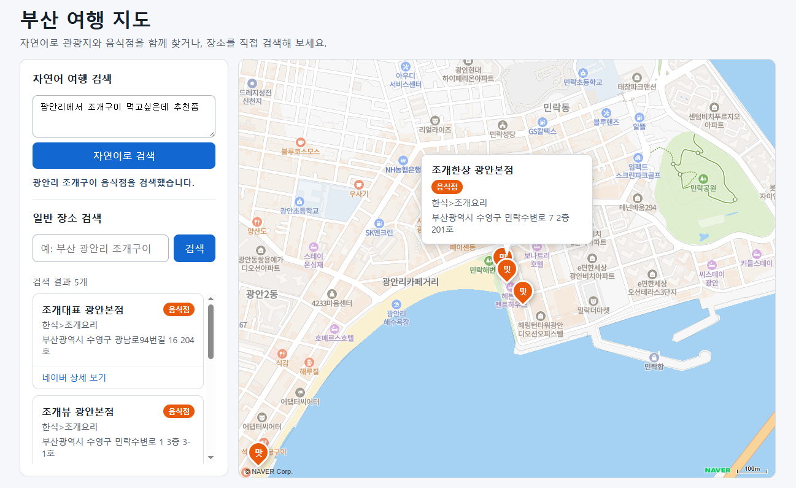

# Day 3 진행 보고서

> 팀: 부산트립  
> 작성일: 2026-07-14  
> 작성 범위: 네이버 장소 검색, 네이버 지도, Gemma 자연어 분석, 통합 여행 검색, 부산 AVI 지점 교통량

## 오늘 구현한 핵심 기능

오늘은 기능을 한 번에 결합하지 않고 외부 API별 단독 연동부터 화면 연결까지 5단계로 나누어 구현했다.

| 단계 | 구현 내용 | 사용자 흐름 |
| --- | --- | --- |
| 1단계 | 네이버 지역 검색 API 연동 | 검색어 입력 → 백엔드가 실제 네이버 장소 검색 → 최대 5개 장소 반환 |
| 2단계 | 검색 결과와 네이버 지도 연결 | 장소 카드 출력 → 마커 표시 → 카드·마커 클릭 시 서로 선택 상태와 정보창 연동 |
| 3단계 | Gemini API에 호스팅된 Gemma 모델 연동 | 자연어 입력 → 부산 지역, 검색 의도, 관광지·음식점 검색어를 JSON으로 구조화 |
| 4단계 | Gemma 분석과 네이버 장소 검색 통합 | 자연어 분석 → 의도에 맞는 관광지·음식점 검색 → 중복 제거 → 지도 마커 표시 |
| 5단계 | 부산 AVI 교통량 API 단독 연동 | `AVI 지점 교통량` 토글 ON → AVI 지점 마커 표시 → 측정 시각과 교통량 확인 |

### 전체 처리 흐름

```text
사용자 자연어
  → POST /api/travel/search
  → Gemma가 SearchCondition 생성
  → 네이버 지역 검색 API 호출
  → 관광지·음식점에 TOURISM / RESTAURANT 타입 부여
  → 중복 제거 및 부분 실패 처리
  → React 장소 카드 + 네이버 지도 마커 표시

AVI 지점 교통량 토글 ON
  → GET /api/traffic/avi
  → 부산 AVI 교통량 API 호출
  → 유효한 좌표가 있는 지점만 반환
  → 장소 마커와 별도인 AVI 마커 표시
```

### 팀원 작업 통합 대상

팀원이 공유한 관광 데이터 API 클라이언트 작업도 Day 3 범위에 함께 기록한다.

| 작업 | 역할 | 현재 저장소 기준 상태 |
| --- | --- | --- |
| `LocalTourismClient` | 지역별 관광 데이터 조회 | 팀원 구현 공유됨 / 현재 작업 트리에는 아직 미통합 |
| `RelatedTourismClient` | 관광 데이터 검색 및 지역별 조회 | 팀원 구현 공유됨 / 현재 작업 트리에는 아직 미통합 |

관련 공유 자료: [Claude Code Artifact](https://claude.ai/code/artifact/ef50e9a5-1102-4b9b-a661-fcf9fe947526)

> 현재 브랜치에는 위 두 클래스가 없으므로 세부 요청 URL, 요청 파라미터, 원본 응답 DTO는 추정해서 적지 않았다. 팀원 브랜치를 합칠 때 실제 코드 기준으로 이 표와 API 계약을 갱신한다.

## 현재 진행 상태

| 영역 | 상태 | 확인 내용 |
| --- | --- | --- |
| Spring Boot 백엔드 | 완료 | 장소 검색, LLM 분석, 통합 검색, AVI 조회 엔드포인트 구현 |
| React 프론트엔드 | 완료 | 일반 검색, 자연어 검색, 결과 카드, 장소 마커, AVI 토글·마커 구현 |
| 네이버 지도 | 완료 | 검색 결과 bounds 조정, 단일 결과 이동, 카드·마커·정보창 상호작용 |
| Gemma | 완료 | Google AI Studio API 키와 환경변수 모델명을 이용한 REST 호출 |
| 네이버 지역 검색 | 완료 | 실제 네이버 검색 결과만 사용하고 HTML 제목 및 좌표 변환 처리 |
| AVI 지점 교통량 | 완료 | 실제 필드 매핑, 좌표 누락 제외, XML 오류와 인증 오류 처리 |
| 관광 데이터 클라이언트 | 통합 대기 | 팀원이 구현한 `LocalTourismClient`, `RelatedTourismClient` 병합 필요 |
| 버스·도시철도 | 미구현 | 이번 Day 3 범위에서 제외 |
| 관광지와 가장 가까운 AVI 계산 | 미구현 | 이번 Day 3 범위에서 제외 |

검증 결과:

- 백엔드 테스트: **33개 성공, 실패 0개**
- 백엔드 실행 JAR 생성: 성공
- 프론트엔드 TypeScript/Vite 빌드: 성공
- 프론트엔드 lint: 성공
- AVI 라이브 호출: HTTP 200, 유효 좌표가 있는 지점 75개 확인
- API 키 로그 노출 검사: 노출 없음
- 현재 서버 상태: 팀원이 직접 실행할 수 있도록 백엔드와 프론트엔드 모두 종료된 상태

## 계획한 API 계약

### 애플리케이션 API

| Method | 경로 | 사용 시점 | 주요 응답 |
| --- | --- | --- | --- |
| `GET` | `/api/system/health` | 프론트 또는 개발자가 백엔드 기동 상태를 확인할 때 | `{ "status": "UP" }` |
| `GET` | `/api/system/config-status` | 외부 API 설정 여부만 확인할 때. 키 값은 반환하지 않음 | 네이버·Gemini·날씨 설정 여부 |
| `GET` | `/api/places/search?query=...` | 사용자가 일반 장소 검색창에서 직접 검색할 때 | `Place[]` |
| `POST` | `/api/llm/analyze` | 자연어를 장소 검색 조건으로만 구조화할 때 | `SearchCondition` |
| `POST` | `/api/travel/search` | 자연어 분석과 실제 네이버 장소 검색을 한 번에 수행할 때 | 조건, 장소, 부분 실패 목록 |
| `GET` | `/api/traffic/avi` | 사용자가 `AVI 지점 교통량` 토글을 켤 때 | `AviTrafficStation[]` |

### `GET /api/places/search`

요청 예시:

```http
GET /api/places/search?query=부산 해운대 관광지
```

응답 구조:

```json
[
  {
    "name": "해운대해수욕장",
    "category": "여행,명소>해수욕장",
    "address": "부산광역시 해운대구 우동",
    "roadAddress": "부산광역시 해운대구 해운대해변로 264",
    "latitude": 35.1593251,
    "longitude": 129.160384,
    "link": "네이버 상세 링크"
  }
]
```

처리 규칙:

- 네이버 지역 검색 API에 `display=5`, `start=1`, `sort=random`을 전달한다.
- `title`의 HTML 태그와 HTML 엔티티를 제거한다.
- 네이버 `mapx`, `mapy` 정수 좌표를 `10,000,000`으로 나누어 WGS84 경도·위도로 변환한다.
- 결과가 없으면 `200 OK`와 빈 배열을 반환한다.

### `POST /api/llm/analyze`

요청:

```json
{
  "message": "광안리에서 바다를 보고 근처에서 조개구이를 먹고 싶어요."
}
```

응답:

```json
{
  "intent": "COURSE_SEARCH",
  "area": "부산 광안리",
  "tourismQuery": "부산 광안리 관광지",
  "restaurantQuery": "부산 광안리 조개구이",
  "trafficRequired": false,
  "busRequired": false,
  "subwayRequired": false
}
```

사용 방식:

- Gemma는 장소를 직접 추천하지 않고 네이버 지역 검색에 사용할 조건만 생성한다.
- 지원 의도는 `TOURISM_SEARCH`, `RESTAURANT_SEARCH`, `COURSE_SEARCH` 세 가지다.
- Markdown 코드 블록이나 JSON 앞뒤 설명이 있어도 첫 JSON 객체를 추출한다.
- 누락된 필드는 빈 문자열 또는 `false`로 처리하며 잘못된 `intent`는 실패 처리한다.
- JSON 파싱 실패 시 한 번만 보정 요청하고, 두 번째도 실패하면 분석 실패 응답을 반환한다.
- 부산 외 지역 요청은 네이버 검색 전에 차단한다.

### `POST /api/travel/search`

요청:

```json
{
  "message": "광안리에서 바다를 보고 조개구이를 먹고 싶어요."
}
```

응답 구조:

```json
{
  "message": "광안리 관광지와 조개구이 음식점을 검색했습니다.",
  "condition": {
    "intent": "COURSE_SEARCH",
    "area": "부산 광안리",
    "tourismQuery": "부산 광안리 관광지",
    "restaurantQuery": "부산 광안리 조개구이",
    "trafficRequired": false,
    "busRequired": false,
    "subwayRequired": false
  },
  "places": [
    {
      "name": "네이버 검색으로 확인한 실제 장소",
      "type": "TOURISM",
      "category": "관광지 카테고리",
      "address": "지번 주소",
      "roadAddress": "도로명 주소",
      "latitude": 35.0,
      "longitude": 129.0,
      "link": "네이버 상세 링크"
    }
  ],
  "partialFailures": []
}
```

의도별 호출:

| intent | 네이버 호출 |
| --- | --- |
| `TOURISM_SEARCH` | `tourismQuery`만 호출 |
| `RESTAURANT_SEARCH` | `restaurantQuery`만 호출 |
| `COURSE_SEARCH` | 두 검색어 모두 호출 |

한쪽 검색이 실패해도 다른 쪽 결과는 반환하고, 실패한 공급자는 `partialFailures`에 기록한다. 장소 중복은 `이름 + 위도 + 경도` 조합으로 제거한다.

### `GET /api/traffic/avi`

요청 예시:

```http
GET /api/traffic/avi
```

실제 라이브 호출에서 확인한 응답 예시:

```json
[
  {
    "stationName": "감전IC(램프진입)",
    "measuredAt": "2026-07-14T15:00:00",
    "trafficVolume": 268,
    "latitude": 35.150968,
    "longitude": 128.979685
  }
]
```

공공데이터 원본 필드 매핑:

| 원본 필드 | 애플리케이션 필드 | 의미 |
| --- | --- | --- |
| `aviSpotNm` | `stationName` | AVI 지점명 |
| `statsDt` | `measuredAt` | 생성·측정 시각 |
| `vol` | `trafficVolume` | 수집 교통량 |
| `lat` | `latitude` | 위도 |
| `lot` | `longitude` | 경도 |

처리 규칙:

- `serviceKey`, `pageNo=1`, `numOfRows=100`으로 부산 AVI API를 호출한다.
- Encoding 또는 Decoding 키를 한 번만 디코딩한 뒤 URI 변수로 한 번 인코딩해 이중 인코딩을 방지한다.
- HTTP 200으로 반환되는 XML 오류와 JSON `resultCode` 실패를 모두 확인한다.
- 좌표가 없거나 유효 범위를 벗어난 항목은 지도 응답에서 제외한다.
- 화면에서는 혼잡도가 아니라 **`AVI 지점 교통량`**으로 표시한다.

### 외부 API와 환경변수

| 외부 API | 사용 목적 | 환경변수 |
| --- | --- | --- |
| 네이버 지역 검색 API | 관광지·음식점의 실제 장소 검색 | `NAVER_SEARCH_CLIENT_ID`, `NAVER_SEARCH_CLIENT_SECRET` |
| 네이버 지도 JavaScript API | 지도와 마커 표시 | `VITE_NAVER_MAP_CLIENT_ID` |
| Google Gemini API의 Gemma 모델 | 자연어 요청을 검색 조건 JSON으로 변환 | `GEMMA_API_KEY`, `GEMMA_MODEL`, `GEMMA_BASE_URL` |
| 부산 AVI 교통량 API | AVI 지점별 측정 시각과 교통량 조회 | `PUBLIC_DATA_SERVICE_KEY`, `BUSAN_AVI_BASE_URL` |

실제 키 값은 코드, 문서, 로그에 기록하지 않는다.

## 완료한 기능, 미완료 기능

### 완료

- [x] 네이버 지역 검색 API 원본 DTO 매핑
- [x] 장소명 HTML 태그 제거와 좌표 변환
- [x] 일반 검색 결과 카드와 네이버 지도 마커 연결
- [x] 새 검색 시 기존 장소 마커 제거
- [x] 지도 bounds 조정과 카드·마커·정보창 상호작용
- [x] Gemma REST API 단독 호출
- [x] JSON 코드 블록·앞뒤 설명·필드 누락·잘못된 enum 방어
- [x] 부산 외 지역 요청 차단
- [x] 자연어 분석 결과와 네이버 장소 검색 통합
- [x] 관광지·음식점 타입 구분과 중복 제거
- [x] 관광지·음식점 검색의 부분 실패 처리
- [x] 부산 AVI API 실제 응답 필드 확인 및 DTO 변환
- [x] XML 오류, `resultCode` 실패, 인증키 인코딩 처리
- [x] AVI 토글, 전용 마커, 정보창, 토글 OFF 정리

### 미완료 또는 다음 통합 범위

- [ ] 팀원의 `LocalTourismClient`, `RelatedTourismClient`를 현재 백엔드에 병합하고 DTO·예외 계약 확인
- [ ] 관광 데이터와 현재 네이버 검색 결과의 역할 및 중복 기준 결정
- [ ] 실제 실행 화면과 API 요청·응답 스크린샷 파일 추가
- [ ] 버스·정류장 API 연동
- [ ] 도시철도·지하철 API 연동
- [ ] 관광지와 가장 가까운 AVI 지점 계산
- [ ] 교통량을 이용한 관광지 추천 또는 순위 계산
- [ ] 날씨 API 실제 연동

## 요청-응답 스크린샷





## 내일 할 일 계획

1. 팀원의 `LocalTourismClient`, `RelatedTourismClient` 브랜치를 병합한다.
2. 두 관광 클라이언트의 실제 Base URL, 요청 파라미터, 응답 DTO, 오류 코드를 문서화한다.
3. 관광 데이터와 네이버 검색의 책임을 정한다.
   - 관광 콘텐츠 설명·분류는 관광 데이터 API
   - 최신 장소명·주소·지도 링크는 네이버 지역 검색
4. 중복 장소 식별 기준과 좌표 체계를 통일한다.
5. 날씨 API 연동.
6. 프론트엔드에서 일반 검색, 자연어 검색, AVI 토글의 전체 시나리오를 함께 점검한다.
7. 다음 우선순위를 팀과 정한 뒤 버스 또는 도시철도 API를 한 종류씩 단독 연동한다.

## 접속 주소

http://127.0.0.1:5173

