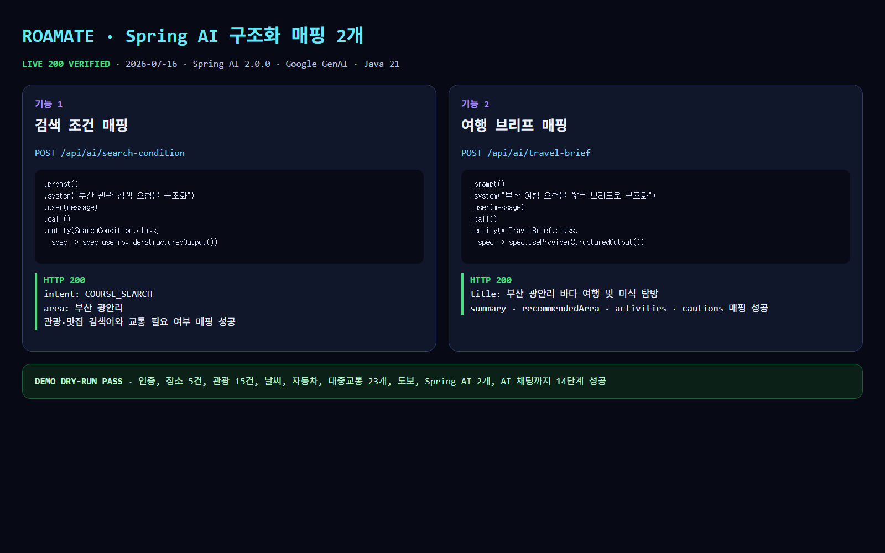
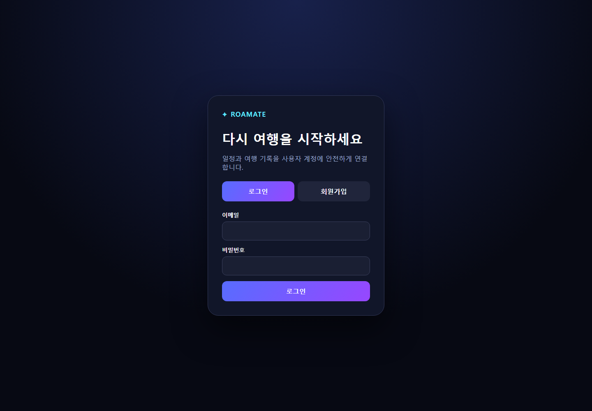

# ROAMATE · 부산 AI 여행 서비스

ROAMATE는 현재 위치와 실제 관광·장소·날씨·경로 데이터를 AI 대화와 지도에 연결하는 부산 여행 데모입니다. React 대시보드와 Spring WebFlux API로 구성되며, 로그인한 사용자만 여행 기능을 이용할 수 있습니다.

2026-07-16 안정화 기준으로 백엔드 테스트 60개, 프런트엔드 빌드·린트, 14단계 라이브 dry-run을 통과했습니다.

## 1. 데모 접속 경로

데모 PC와 같은 내부망 `192.168.40.x`에 연결한 뒤 접속합니다.

| 구분 | 주소 | 상태 |
| --- | --- | --- |
| 데모 화면 | **http://192.168.40.1:5173** | `0.0.0.0:5173` 바인딩 |
| 백엔드 API | **http://192.168.40.1:8080** | `0.0.0.0:8080` 바인딩 |
| 헬스 체크 | **http://192.168.40.1:8080/api/system/health** | `{"status":"UP"}` |
| 로컬 화면 | http://localhost:5173 | 개발 PC에서 사용 |

내부망 IP는 DHCP나 어댑터 상태에 따라 달라질 수 있습니다. 실행 PC에서 `ipconfig`로 IPv4를 확인하고, 주소가 바뀌면 다음 세 값을 함께 변경합니다.

```env
# backend/.env
FRONTEND_URL=http://192.168.40.1:5173

# frontend/.env
VITE_API_BASE_URL=http://192.168.40.1:8080
```

네이버 클라우드 Dynamic Map의 Web 서비스 URL에도 `http://192.168.40.1:5173`을 등록해야 합니다.

## 2. 구현 기능

| 기능 | 상태 | 실제 연동 |
| --- | --- | --- |
| 회원가입·로그인·로그아웃 | 완료 | BCrypt, WebFlux 세션, CSRF |
| 현재 사용자·이메일 중복 확인 | 완료 | 사용자 DB 연동 |
| 네이버 Dynamic Map | 완료 | 현재 위치, 장소 마커, 경로선 |
| 네이버 장소·맛집 검색 | 완료 | Naver Local Search API |
| 관광지 검색 | 완료 | 한국관광공사 공공데이터, 네이버 검색 대체 경로 |
| 현재 위치 기반 날씨 | 완료 | 기상청 단기예보 API |
| 자동차 길찾기 | 완료 | Naver Directions |
| 대중교통·도보 길찾기 | 완료 | ODsay |
| 지도 문맥 기반 AI 채팅 | 완료 | Gemma 우선, Gemini 자동 전환 |
| Spring AI 검색 조건 매핑 | 완료 | `SearchCondition` 구조화 출력 |
| Spring AI 여행 브리프 매핑 | 완료 | `AiTravelBrief` 구조화 출력 |
| AVI 교통량 | 완료 | 부산 공공데이터 AVI API |
| 일정 CRUD·여행 기록 | 미구현 | 후속 단계 |
| 사용자별 채팅 저장 | 미구현 | 현재 대화는 프런트 메모리 상태 |

## 3. 기술 스택

### 백엔드

- Java 21
- Spring Boot 4.1.0
- Spring WebFlux, Spring Security, Spring Data R2DBC
- Spring AI 2.0.0 Google GenAI
- H2 파일 DB
- Gradle Wrapper

### 프런트엔드

- React 19, TypeScript
- Vite 8
- Naver Maps JavaScript API v3
- oxlint

## 4. 처음 실행하는 사람을 위한 준비

### 필수 프로그램

- Git
- JDK 21
- Node.js 20 이상과 npm
- Windows PowerShell 5.1 이상

### 저장소 받기

현재 안정화 결과는 `junho` 브랜치에 있습니다.

```powershell
git clone -b junho https://github.com/raks030517-netizen/2026_TOUR_COMPETITION.git
cd 2026_TOUR_COMPETITION
Copy-Item backend/.env.example backend/.env
Copy-Item frontend/.env.example frontend/.env
```

`.env`는 Git에서 제외됩니다. 실제 키를 README, 소스 코드, `.env.example`에 넣지 마세요.

## 5. 환경변수

### `backend/.env`

```env
NAVER_SEARCH_CLIENT_ID=
NAVER_SEARCH_CLIENT_SECRET=
GEMMA_API_KEY=
GEMMA_MODEL=gemma-4-31b-it
GEMMA_FALLBACK_MODEL=gemini-3.5-flash
GEMMA_BASE_URL=https://generativelanguage.googleapis.com/v1beta
DATA_GO_KR_API_KEY=
NAVER_MAPS_KEY_ID=
NAVER_MAPS_KEY=
ODSAY_API_KEY=
FRONTEND_URL=http://192.168.40.1:5173
SPRING_AI_CHAT_MODEL=google-genai
SESSION_COOKIE_SECURE=false
```

| 변수 | 용도 |
| --- | --- |
| `NAVER_SEARCH_CLIENT_ID`, `NAVER_SEARCH_CLIENT_SECRET` | 네이버 지역 검색 |
| `NAVER_MAPS_KEY_ID`, `NAVER_MAPS_KEY` | 서버용 자동차 길찾기 |
| `ODSAY_API_KEY` | 대중교통·도보 길찾기, 등록 서버 IP 확인 필요 |
| `DATA_GO_KR_API_KEY` | 관광·날씨·AVI 공공데이터 공용 키 |
| `GEMMA_API_KEY` | Google Generative Language API |
| `GEMMA_MODEL` | 우선 AI 모델 |
| `GEMMA_FALLBACK_MODEL` | 우선 모델 429/5xx 시 자동 전환 모델 |
| `FRONTEND_URL` | CORS 허용 프런트 Origin |
| `SESSION_COOKIE_SECURE` | 로컬 HTTP는 `false`, HTTPS는 `true` |

### `frontend/.env`

```env
VITE_NAVER_MAP_CLIENT_ID=
VITE_API_BASE_URL=http://192.168.40.1:8080
```

`VITE_` 변수는 브라우저 번들에서 보일 수 있으므로 네이버 Dynamic Map 브라우저 Client ID 외의 비밀키를 넣지 않습니다.

## 6. 실행 방법

### 백엔드

```powershell
cd backend
.\gradlew.bat bootRun --no-daemon
```

JDK가 자동으로 잡히지 않는 Windows PC:

```powershell
$env:JAVA_HOME='C:\Program Files\Eclipse Adoptium\jdk-21.0.11.10-hotspot'
.\gradlew.bat bootRun --no-daemon
```

### 프런트엔드

새 PowerShell 창에서 실행합니다.

```powershell
cd frontend
npm.cmd install
npm.cmd run dev -- --host 0.0.0.0
```

프런트 `5173`, 백엔드 `8080`이 모두 LISTENING이면 브라우저에서 데모 주소로 접속해 회원가입 후 로그인합니다.

## 7. 데모 dry-run 재현

두 서버가 실행 중일 때 저장소 루트에서 실행합니다.

```powershell
powershell -ExecutionPolicy Bypass -File scripts/demo-dry-run.ps1
```

로컬 백엔드로 검증할 때:

```powershell
powershell -ExecutionPolicy Bypass -File scripts/demo-dry-run.ps1 `
  -BaseUrl http://localhost:8080
```

스크립트는 매번 새 테스트 계정을 만들고 다음 14단계를 순서대로 확인합니다.

1. 헬스 체크
2. 회원가입
3. 새 세션 로그인
4. 현재 사용자
5. 네이버 장소 검색
6. 관광 공공데이터
7. 현재 위치 날씨
8. 자동차 경로
9. 대중교통 경로
10. 도보 경로
11. Spring AI 검색 조건 매핑
12. Spring AI 여행 브리프 매핑
13. 지도 문맥 AI 채팅
14. 최종 PASS 출력

2026-07-16 라이브 결과:

```text
health=UP
places=5
tourism=15
weather=33.0C / 구름많음
car=9656m / 2202s
transit=23 routes
walk=9301m / 8457s
springAiSearchCondition=COURSE_SEARCH
springAiTravelBrief=부산 광안리 바다 여행 및 미식 탐방
status=PASS
```

전체 출력은 [`docs/demo/latest-dry-run.txt`](docs/demo/latest-dry-run.txt)에 백업했습니다.

## 8. Spring AI 매핑 기능 2개

구현 위치:

- `backend/src/main/java/com/busantrip/service/SpringAiMappingService.java`
- `backend/src/main/java/com/busantrip/controller/SpringAiController.java`
- `backend/src/main/java/com/busantrip/dto/ai/AiTravelBrief.java`

### 기능 1: 검색 조건 매핑

```http
POST /api/ai/search-condition
Content-Type: application/json

{"message":"부산 광안리에서 바다를 보고 근처 맛집도 찾고 싶어요."}
```

```java
chatClient.prompt()
    .system("부산 관광 검색 요청을 구조화한다...")
    .user(message)
    .call()
    .entity(SearchCondition.class,
        spec -> spec.useProviderStructuredOutput());
```

라이브 응답은 `COURSE_SEARCH`, 부산 광안리, 관광·맛집 검색어와 교통 필요 여부가 포함된 구조화 JSON입니다.

### 기능 2: 여행 브리프 매핑

```http
POST /api/ai/travel-brief
Content-Type: application/json

{"message":"부산 광안리에서 바다를 보고 근처 맛집도 찾고 싶어요."}
```

```java
chatClient.prompt()
    .system("부산 여행 요청을 짧은 브리프로 구조화한다...")
    .user(message)
    .call()
    .entity(AiTravelBrief.class,
        spec -> spec.useProviderStructuredOutput());
```

라이브 응답은 `title`, `summary`, `recommendedArea`, `activities`, `cautions` 필드로 매핑됩니다.



## 9. API 목록

인증 API와 헬스 체크를 제외한 API에는 `BUSANTRIP_SESSION` 쿠키가 필요합니다. POST 요청은 먼저 `/api/auth/csrf`에서 받은 헤더와 토큰을 포함해야 합니다.

| Method | 경로 | 기능 |
| --- | --- | --- |
| POST | `/api/auth/signup` | 회원가입 |
| POST | `/api/auth/login` | 로그인 |
| POST | `/api/auth/logout` | 로그아웃 |
| GET | `/api/auth/me` | 현재 사용자 |
| GET | `/api/auth/check-email?email=...` | 이메일 중복 확인 |
| GET | `/api/auth/csrf` | CSRF 토큰 발급 |
| GET | `/api/system/health` | 서버 상태 |
| GET | `/api/system/config-status` | 외부 API 설정 여부 |
| GET | `/api/places/search?query=...` | 네이버 장소 검색 |
| GET | `/api/tourism/local?...` | 지역 중심 관광지 |
| GET | `/api/tourism/related/search?...` | 연관 관광지 검색 |
| GET | `/api/weather/current?latitude=...&longitude=...` | 현재 좌표 단기예보 |
| GET | `/api/routes?mode=CAR&...` | 자동차 경로 |
| GET | `/api/routes?mode=TRANSIT&...` | 대중교통 경로 목록 |
| GET | `/api/routes?mode=WALK&...` | 도보 경로 |
| GET | `/api/traffic/avi` | AVI 교통량 |
| POST | `/api/llm/analyze` | 자연어 검색 조건 분석 |
| POST | `/api/travel/search` | AI 분석과 장소 통합 검색 |
| POST | `/api/ai/chat` | 지도 문맥 AI 채팅 |
| POST | `/api/ai/search-condition` | Spring AI 검색 조건 매핑 |
| POST | `/api/ai/travel-brief` | Spring AI 여행 브리프 매핑 |

## 10. 모델 및 외부 서비스

| 서비스 | 역할 | 장애 처리 |
| --- | --- | --- |
| Spring AI Google GenAI | 두 개의 타입 기반 구조화 매핑 | `GEMMA_FALLBACK_MODEL` 사용 |
| Google `generateContent` | 검색 분석과 AI 채팅 | Gemma 우선, 429/5xx 재시도 후 Gemini 전환 |
| Naver Local Search | 장소·맛집 | 관광 공공데이터 보완 |
| Naver Dynamic Map | 지도·마커·경로선 | 등록 Origin 필요 |
| Naver Directions | 자동차 경로 | 오류 코드와 메시지 반환 |
| ODsay | 대중교통·도보 경로 | API 키와 등록 서버 IP 필요 |
| 한국관광공사 | 관광지 | 실패 시 UI가 네이버 장소 검색 사용 |
| 기상청 | 현재 위치 단기예보 | 위·경도를 기상 격자로 변환 |
| 부산 AVI | 교통량 | 공공데이터 활용 신청 필요 가능 |

## 11. 테스트

백엔드 테스트는 실행 서버 DB와 충돌하지 않도록 인메모리 H2를 사용합니다.

```powershell
cd backend
.\gradlew.bat test --no-daemon
```

VS Code Java 확장이 `backend/build`를 잠근 경우:

```powershell
.\gradlew.bat test --no-daemon `
  -PisolatedBuildDir="$PWD\..\.gradle-user-home\verification-build"
```

최종 결과: **60 tests, failures 0, errors 0**.

```powershell
cd frontend
npm.cmd run build
npm.cmd run lint
```

최종 결과: TypeScript/Vite 프로덕션 빌드 성공, oxlint 성공.

## 12. 데모 캡처

| 증빙 | 파일 |
| --- | --- |
| 내부망 로그인 화면 | [`docs/images/demo/01-lan-login.png`](docs/images/demo/01-lan-login.png) |
| Spring AI 두 기능 코드·라이브 200 | [`docs/images/demo/02-spring-ai-code.png`](docs/images/demo/02-spring-ai-code.png) |
| dry-run 원문 | [`docs/demo/latest-dry-run.txt`](docs/demo/latest-dry-run.txt) |
| 재생성 가능한 Spring AI 증거 HTML | [`docs/demo/spring-ai-evidence.html`](docs/demo/spring-ai-evidence.html) |



## 13. 인증과 데이터 저장

- 비밀번호는 BCrypt 해시로 저장하며 응답 DTO에 포함하지 않습니다.
- 인증은 JWT가 아닌 WebFlux 서버 세션입니다.
- 세션 쿠키는 `HttpOnly`, `SameSite=Lax`입니다.
- 상태 변경 요청은 CSRF 토큰을 검증합니다.
- 사용자 DB는 `backend/data/busantrip.mv.db`이며 Git에서 제외됩니다.
- `CurrentUserService.requireUserId()`가 후속 일정·기록 소유권 검증 기준입니다.

## 14. 제한사항

- `http://192.168.40.1:5173` 같은 내부망 HTTP 주소에서는 브라우저가 GPS를 차단할 수 있습니다. GPS 시연은 `localhost`를 사용하거나 HTTPS 인증서를 적용해야 합니다. 실패 시 부산시청 좌표를 기본값으로 사용합니다.
- 네이버 Dynamic Map 콘솔에 실제 프런트 Origin이 없으면 지도 SDK 인증이 실패합니다.
- ODsay는 API 키에 등록된 서버 공인 IP와 실제 호출 IP가 일치해야 합니다.
- 외부 API는 호출량, 활용 신청 상태, 공급자 장애의 영향을 받습니다.
- 개발용 H2와 인메모리 세션은 단일 서버 데모용입니다. 운영 환경은 PostgreSQL과 공유 세션 저장소가 필요합니다.
- 서버 재시작 시 로그인 세션은 초기화되지만 가입 계정은 H2 파일에 남습니다.
- 일정 CRUD, 여행 기록 자동 생성, 사용자별 채팅 영속화는 아직 구현되지 않았습니다.

## 15. 문제 해결

| 증상 | 확인 사항 |
| --- | --- |
| 로그인 POST 403 | 프런트와 API 호스트를 `localhost`끼리 또는 내부망 IP끼리 맞추고 새로고침 |
| 로그인 401 | 가입 계정과 비밀번호 확인, 필요하면 다시 회원가입 |
| 네이버 지도 빈 화면 | `VITE_NAVER_MAP_CLIENT_ID`, Dynamic Map 선택, Web 서비스 URL 확인 |
| 다른 PC에서 접속 불가 | 같은 내부망인지 확인하고 Windows 방화벽 TCP 5173·8080 허용 |
| 현재 위치 실패 | 내부망 HTTP 대신 `localhost` 또는 HTTPS 사용, 위치 권한 허용 |
| ODsay 401·403 | API 키와 등록 서버 공인 IP 확인 |
| Google AI 429·5xx | 자동 재시도와 보조 모델 전환 후에도 실패하면 할당량·서비스 상태 확인 |
| Gradle 결과 파일 잠김 | 위의 `isolatedBuildDir` 명령 사용 또는 VS Code Java 확장 재시작 |
