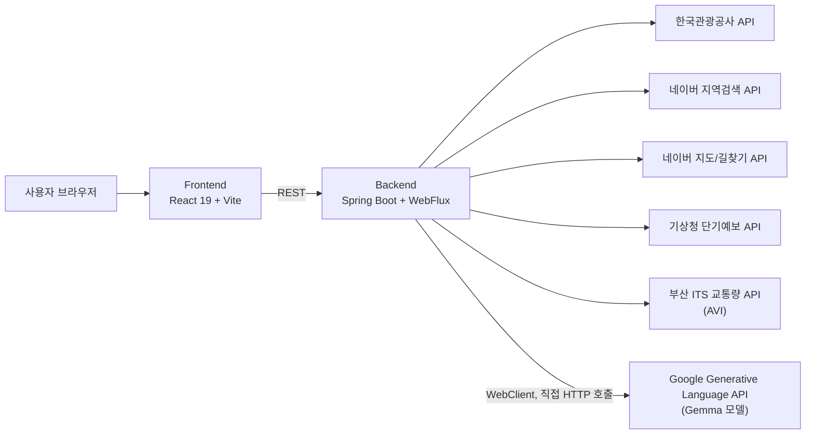

# ROAMATE

**ROAM + MATE** — 부산 여행 중 생기는 변수를 함께 정리하는 AI 여행 메이트입니다.

여행 일자·동행·이동수단·취향을 입력하면 현재 위치를 출발지로 삼아 방문 순서를 제안하고, 지도·경로·Gemma 대화로 다음 행동을 이어갈 수 있습니다. 외부 API 키가 없어도 발표와 기능 검증이 가능하도록 부산 대표 관광지, 경로, 날씨·교통 상태, 대화의 데모 폴백을 내장했습니다.

## 팀 구성

| 팀원 | 담당 영역 |
| --- | --- |
| chrishan ([@mysun1034-cell](https://github.com/mysun1034-cell)) | Backend · API · Fallback |
| narxkim ([@narxkim](https://github.com/narxkim)) | Frontend · Timeline · State |
| nari ([@raks030517-netizen](https://github.com/raks030517-netizen)) | AI flow · Prompt · Demo |
| junho | Route · Map · 2-opt · GPS |

## 핵심 사용자 흐름

1. 여행 일자, 테마, 동행, 이동수단, 여행 속도를 선택합니다.
2. 관광지 후보와 날씨·교통 데이터 상태를 바탕으로 날짜별 코스를 생성합니다.
3. 현재 위치를 반영해 최적 방문 순서와 경로를 계산합니다.
4. Gemma 메이트에게 비·피로·이동수단·취향 변화에 따른 일정 조정을 요청합니다.
5. 변경된 일정·지도·타임라인을 함께 갱신하고 다음 장소로 이동합니다.

## 구현 기능

| 영역 | 기능 |
| --- | --- |
| 관광 탐색 | 관광공사 API 기반 부산 관광지 탐색, API 미설정 시 좌표가 포함된 부산 데모 카탈로그 |
| 일정 설계 | 일자·동행·테마·이동수단·속도 조건으로 1~3일 부산 코스 생성, 날짜별 시간표 제공 |
| 지도 | 네이버 지도 SDK, 미설정 시에도 여행 목록과 경로 흐름을 확인할 수 있는 지도 데모 모드 |
| 경로 | 가까운 장소 우선 + 2-opt 최적화, 네이버 길찾기 API 연결 및 직선거리 폴백 |
| 여행 컨텍스트 | 기상청 단기예보·부산 ITS 교통량을 연결하며, 키 또는 예보 범위가 없으면 상태를 명확히 알리는 데모 폴백 |
| AI 대화 | Gemini 모델 없이 Gemma 기반 여행 요약·일정 조정, 키가 없거나 호출이 실패해도 상황별 안내와 일정 재구성 제공 |
| 위치 | 브라우저 GPS를 출발지로 반영, 권한이 없으면 부산시청을 기본 출발지로 사용 |

## 기술 구성

- Frontend: React 19, TypeScript, Vite, CSS
- Backend: Java 21, Spring Boot, WebFlux, Gradle
- External APIs: 한국관광공사, 네이버 지도/길찾기/지역검색, Gemma hosted endpoint, 기상청·부산 ITS 확장 엔드포인트

AI 대화 기능은 Spring Boot WebFlux의 `WebClient`로 Google Generative Language API(Gemma 모델)를 직접 호출하는 방식입니다. Spring AI 프레임워크(`ChatClient`/`ChatModel` 등)는 사용하지 않습니다.

현재 MVP는 별도 데이터베이스 없이 외부 데이터와 데모 카탈로그로 동작합니다. 회원·저장·즐겨찾기 기능은 다음 확장 단계의 범위입니다.

## 아키텍처



## 실행 방법

### 1. 사전 조건

- Node.js 22 이상
- Java 21 이상 JDK

### 2. 환경 변수 준비

```powershell
Copy-Item frontend/.env.example frontend/.env
Copy-Item backend/.env.example backend/.env
```

키 없이도 앱은 데모 모드로 실행됩니다. 실제 지도와 실시간 데이터를 사용하려면 각각의 API 키를 `.env`에 채우세요. `.env`는 Git에 포함되지 않습니다.

### 3. 백엔드 실행

```powershell
cd backend
.\gradlew.bat bootRun
```

### 4. 프런트엔드 실행

```powershell
cd frontend
npm ci
npm run dev
```

브라우저에서 `http://localhost:5173`을 엽니다.

## 검증 명령

```powershell
cd frontend
npm run build
npm run lint

cd ../backend
.\gradlew.bat test
```

## 주요 API

| Method | Path | 설명 |
| --- | --- | --- |
| GET | `/api/system/health` | 서버 상태 확인 |
| GET | `/api/tourism/related/search` | 테마/관광지 검색 |
| POST | `/api/routes/optimize` | 장소 배열의 방문 순서와 경로 계산 |
| POST | `/api/ai/chat` | 여행 문맥 기반 대화 |
| POST | `/api/itineraries/plan` | 조건 입력 기반 날짜별 여행 일정 생성 |
| POST | `/api/itineraries/adjust` | 자연어 변경 요청을 반영해 일정과 경로 재구성 |
| POST | `/api/travel/search` | 자연어 여행·맛집 통합 검색 |
| GET | `/api/weather/forecast` | 기상청 예보 조회 |
| GET | `/api/traffic/avi` | 부산 ITS 교통량 조회 |

## 데모 시나리오

1. 시작일·종료일과 `바다`, `야경` 테마를 선택하고 **일정 만들기**를 누릅니다.
2. 날짜별 타임라인, 날씨·교통 상태, 지도 경로를 확인합니다.
3. **여행 시작하기**를 눌러 다음 장소를 이동합니다.
4. 하단의 ROAMATE AI에서 `비가 오면 실내 코스로 바꿔줘`를 누릅니다.
5. F1963·자갈치시장 중심의 실내 대체 일정으로 지도와 타임라인이 갱신되는지 확인합니다.

API 키가 없는 발표 환경에서도 위 흐름 전체가 동작합니다.
